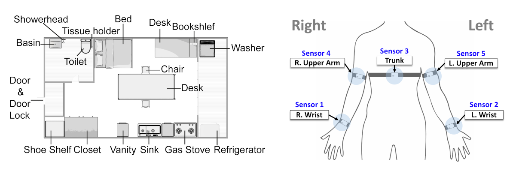

# Jeonju University IMU (JU-IMU) Dataset

JU-IMU is an open dataset for movement classification of hemiparetic stroke patients (Stroke group) and non-disabled individuals (ND group) with inertial measurement units (IMU) sensor data.
The dataset consists of two different tasks or sets of movments - the range of motion (ROM) task and the activities of daily living (ADL) task.
The ROM task consists of 14 different movement that are often used to evaluate motor functions of patients with movement disabilities, such as elbow flexion, scaption, and shoulder rotation.
The ADL task comprises 56 movements from daily activities, such as brushing hair, drinking water, and opening doors. The full lists of movements are available at the "information" directory of the current repository.

* ROM_movements.csv
* ADL_movements.csv

### Movement Types
Movements are divided into three categories that the original researchers defined - UNI, BIA, and BIS.
* UNI (unimanual): movements that involve mostly one arm and hand only
* BIA (bimanual asymmetric): movments that use both arms and hands, but one arm plays a major role while the other side is supportive
* BIS (bimanual symmetric): movements that involve both arms hands with similar patterns and activities

The ROM task consists of only UNI movements (the affected limb for Stroke and the dominant limb for ND).  
The ADL task includes all three types of movements.

### Participants
29 ND individuals and 15 Stroke patients participated in the study. Nine out of 15 Stroke patients had right hemiparesis and the other patients had the left hemiparesis.
Patients were asked to use the affected limb (not a dominant limb for the left hemiparesis patients) as a major hand when performing asymetric tasks.
For detailed information of inclusion criteria, please refer to our manuscript linked below.
The Full participants lists for each task are available at the "information" directory of this repository.

* ROM_participants.csv
* ADL_participants.csv

### Data File Description
A single data file contains a single movement segment of a particular participant as a csv file.
A file name contains information in the following way:  
> task_participantID_movementID.csv

For example, the file "ROM_ND7_ElbFlex.csv" indicates that it contains the segment of the participant ND7 performing ElbFlex (elbow flexion) of the ROM task.
Inside a csv file, there are 45 columns corresponding to each channel of sensors:

sensor1.accx, sensor1.accy, sensor1.accz, sensor1.gyrx, sensor1.gyry, sensor1.gyrz, sensor1.magx, sensor1.magy, sensor1.magz,  
sensor2.accx, sensor2.accy, sensor2.accz, sensor2.gyrx, sensor2.gyry, sensor2.gyrz, sensor2.magx, sensor2.magy, sensor2.magz, 

...  

sensor5.accx, sensor5.accy, sensor5.accz, sensor5.gyrx, sensor5.gyry, sensor5.gyrz, sensor5.magx, sensor5.magy, sensor5.magz,

where "accx" stands for x-axis of accelerometer, "gyry" for y-axis of gyrometer, and "magz" for z-axis for magnetometer, and so on.
Each row contains sensor values of one time point. The number of rows vary on the length of a segment.

### Download Data
You can download the ROM task data from this [link](https://drive.google.com/drive/folders/1JtIu6wVkFfor2eDxqgVYmepeyELKdsOq?usp=share_link).  
You can download the ADL task data from this [link](https://drive.google.com/drive/folders/1JkiHo9gg9GmBYspHatVEpbdKZ-Yp5ggq?usp=share_link).

### Citation
If you use the dataset for your work, please cite the following: 

### License
[CC BY-NC-ND 4.0 DEED](https://creativecommons.org/licenses/by-nc-nd/4.0/)

